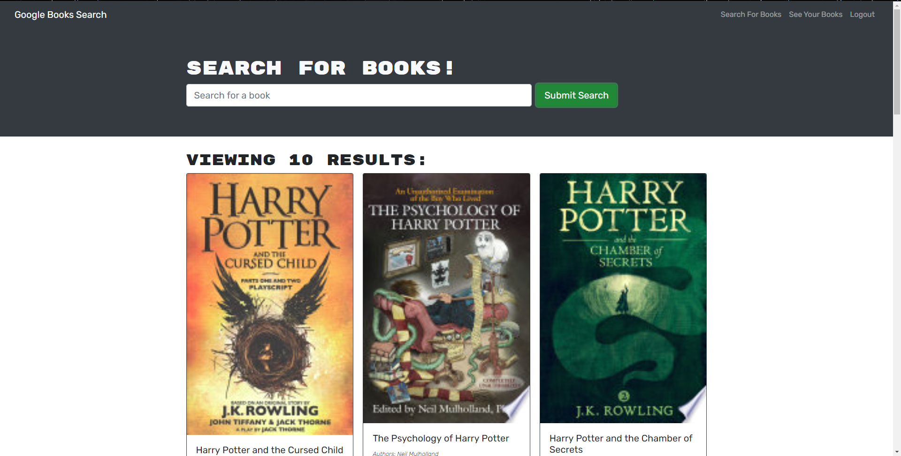

# 21 MERN: Book Search Engine

## Description 

For this application, we were given the starter code with a fully functioning Google Books API search engine built with a RESTful API. Our task was to refactor this starter code to be a GraphQL API built with Apollo Server. The app was built using the MERN stack with a React front end, MongoDB database, and Node.js/Express.js server and API. It's already set up to allow users to save book searches to the back end. 

We were asked to complete the following steps: 

1. Set up an Apollo Server to use GraphQL queries and mutations to fetch and modify data, replacing the existing RESTful API.

2. Modify the existing authentication middleware so that it works in the context of a GraphQL API.

3. Create an Apollo Provider so that requests can communicate with an Apollo Server.

4. Deploy your application to Heroku with a MongoDB database using MongoDB Atlas. 

## Deployed Application 

To view the deployed application please [click here](https://ajay-book-search.herokuapp.com/)

## Table of Contents 

- [Installation](#installation)
- [Back-End-Specifications](#back-end-specifications)
- [Front-End-Specifications](#front-end-specifications)
- [Features](#features)
- [Contribute](#contribute)
- [License](#license)

## Installation

First, clone the repo to your machine. 
Then, in the root folder open the command line and enter 'npm install'. 
After this, enter 'npm run build' and finally enter 'npm run develop' to run both the front end and back end server concurrently. 

## Back End Specifications

For the Back-End, following tasks were completed: 

* `auth.js`: Update the auth middleware function to work with the GraphQL API.

* `server.js`: Implement the Apollo Server and apply it to the Express server as middleware.

	> **Important**: Apollo Server recently migrated to Apollo Server 3. This major-version release impacts how Apollo Server interacts in an Express environment. To implement Apollo Server 2 as demonstrated in the activities, you **MUST** use the following script `npm install apollo-server-express@2.15.0` to install Apollo Server 2. Alternately, to migrate to the latest version of Apollo Server, please refer to the [Apollo Server Docs on Migrating to Apollo Server 3](https://www.apollographql.com/docs/apollo-server/migration/#nodejs) and [Apollo Server Docs on Implementing Apollo Server Express with v3](https://www.apollographql.com/docs/apollo-server/integrations/middleware/#apollo-server-express). Note that if you are using Apollo Server 3 you are required use `await server.start()` before calling `server.applyMiddleware`.

* `Schemas` directory:

	* `index.js`: Export your typeDefs and resolvers.

	* `resolvers.js`: Define the query and mutation functionality to work with the Mongoose models.

		**Hint**: Use the functionality in the `user-controller.js` as a guide.

	* `typeDefs.js`: Define the necessary `Query` and `Mutation` types:

		* `Query` type:

			* `me`: Which returns a `User` type.
		
		* `Mutation` type:

			* `login`: Accepts an email and password as parameters; returns an `Auth` type.

			* `addUser`: Accepts a username, email, and password as parameters; returns an `Auth` type.

			* `saveBook`: Accepts a book author's array, description, title, bookId, image, and link as parameters; returns a `User` type. (Look into creating what's known as an `input` type to handle all of these parameters!)

			* `removeBook`: Accepts a book's `bookId` as a parameter; returns a `User` type.
			
		* `User` type:

			* `_id`

			* `username`

			* `email`

			* `bookCount`

			* `savedBooks` (This will be an array of the `Book` type.)

		* `Book` type:

			* `bookId` (Not the `_id`, but the book's `id` value returned from Google's Book API.)

			* `authors` (An array of strings, as there may be more than one author.)

			* `description`

			* `title`

			* `image`

			* `link`

		* `Auth` type:

			* `token`

			* `user` (References the `User` type.)

## Front End Specifications

For the Front-End, following tasks were completed:

* `queries.js`: This will hold the query `GET_ME`, which will execute the `me` query set up using Apollo Server.

* `mutations.js`:

	* `LOGIN_USER` will execute the `loginUser` mutation set up using Apollo Server.

	* `ADD_USER` will execute the `addUser` mutation.

	* `SAVE_BOOK` will execute the `saveBook` mutation.

	* `REMOVE_BOOK` will execute the `removeBook` mutation.

Additionally, you’ll need to complete the following tasks in each of these front-end files:

* `App.js`: Create an Apollo Provider to make every request work with the Apollo Server.
	
* `SearchBooks.js`:

	* Use the Apollo `useMutation()` Hook to execute the `SAVE_BOOK` mutation in the `handleSaveBook()` function instead of the `saveBook()` function imported from the `API` file.

	* Make sure you keep the logic for saving the book's ID to state in the `try...catch` block! 

* `SavedBooks.js`:

	* Remove the `useEffect()` Hook that sets the state for `UserData`.

	* Instead, use the `useQuery()` Hook to execute the `GET_ME` query on load and save it to a variable named `userData`.

	* Use the `useMutation()` Hook to execute the `REMOVE_BOOK` mutation in the `handleDeleteBook()` function instead of the `deleteBook()` function that's imported from `API` file. (Make sure you keep the `removeBookId()` function in place!)

* `SignupForm.js`: Replace the `addUser()` functionality imported from the `API` file with the `ADD_USER` mutation functionality.

* `LoginForm.js`: Replace the `loginUser()` functionality imported from the `API` file with the `LOGIN_USER` mutation functionality.

## Features 

- apollo-server-express 
- concurrently 
- bcrypt
- express
- jsonwebtoken
- mongoose 
- graphql
- nodemon 
- apollo 
- bootstrap
- jwt-decode
- react-dom 
- react-router-dom
- react-scripts 
- react-bootstrap 

## Contribute

If you would like to contribute to this project please contact me via email at ajaycoolkarni@yahoo.com

## License

This project is released under the [ISC LICENSE](https://img.shields.io/badge/License-ISC-blue.svg)